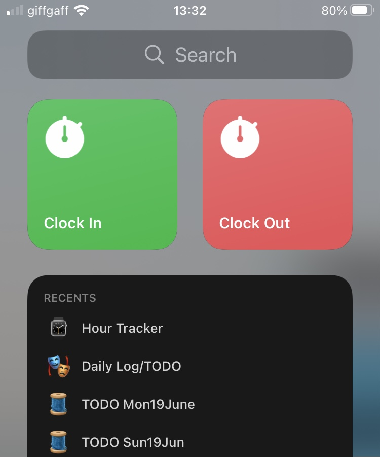

# Ibraheem's Notion Hour Tracker

## Super simple webhooks to track hours in a Notion database.

Supports multiple project tags, deploys via Firebase Cloud Functions.

I use iOS shortcuts to call these webhooks. They are not included here.

If you want to use this, supply a notion token and a database id in `.env` (this should really be in GCP secrets, but this is fine for my personal use). See `.env.example` for more info.

The database should have `Time In` and `Time Out` date columns and a `Project` single select column.

Also does not include `.firebaserc` since this is specific to each deployment.